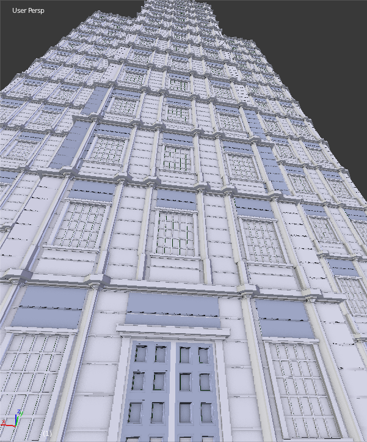

### eita 
Blender addon for procedurally generating buildings

## Relationships and dependencies

distance between windows
  > window width
  < building width / depth

window height
  < floor height
  + offset < floor height (offset pushes up )

### Balconies (internal)

this involves actually pushing the window part in, "balcony" flush with facade.

### Balconies (external)

This will be an extension of "floor separator" using layout.wall loops

we need a balcony section to be extruded

balcony depth
balcony "thickness" + chamfer if 

chamfer horiz?
chamfer underneath?

solid or railing

PER-WINDOW
PER-N-WINDOW ( DIVISIBLE BY N_WINDOWS OBVIOUSLY)

FULL-FLOOR NO WRAP
FULL-FLOOR, WRAP N SIDES
FULL-FLOOR, WRAPAROUND

### About
Fork of @Isimic's project [ProceduralBuildingGenerator](https://github.com/lsimic/ProceduralBuildingGenerator)

### License

GPL-3.0
